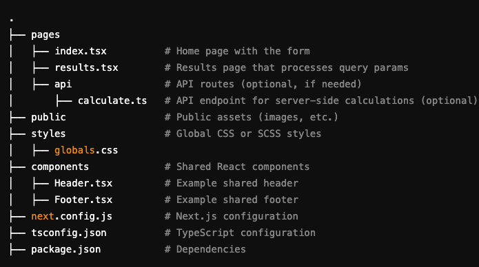
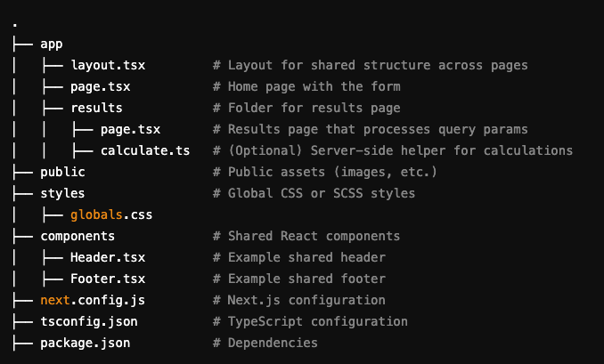
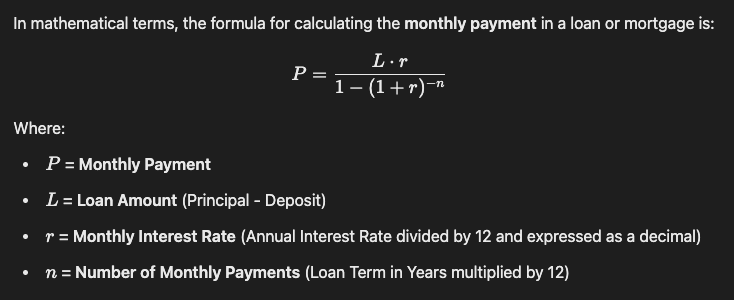
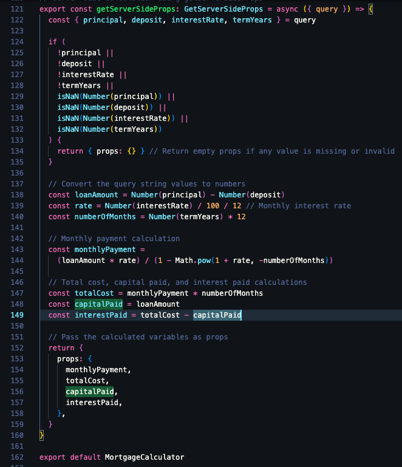
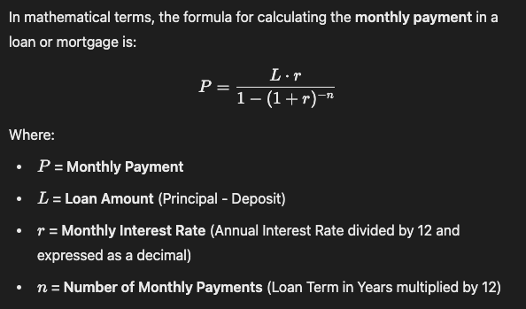

## How to get Server Side Rendered Form working in Next JS using either the Pages Router, and using the newer App Router introduced from Next js version 13 onwards.

## 1. Folder Structure for Pages Router

Explanation:
pages/index.tsx: Contains the homepage and the form.
pages/results.tsx: Handles query parameters and renders results. Uses getServerSideProps to calculate and display the results.
pages/api/calculate.ts: (Optional) If you want an API route to handle calculations instead of server-side props.

## 2. Folder Structure for App Router

Explanation:
app/layout.tsx: The root layout that wraps all pages. Includes components like Header or Footer.
app/page.tsx: The homepage with the form.
app/results/page.tsx: Handles query parameters and renders the calculation results. You can use Server Components and async/await for calculations.
app/results/calculate.ts: (Optional) A server-side function or helper for calculations.

## 1. Using Pages Router

Basically we have a file called mortgage-calculator.tsx in pages directory, which will do both server side and client side rendering.

The client side form is on this file and allows users to add their values in the inputs.
Since we are using method="get" in the <form> this means Next.js, sends form data as a query string appended to the URL.

## How It Works

Form Submission: When the user submits the form, the browser constructs a query string from the form input names and their values, appending it to the URL specified in the action attribute of the <form>.

When submitted, the browser sends the request to:
/mortgage-calculator?principal=200000&deposit=20000&interestRate=5&termYears=30

### Server-Side Handling in Next.js:

The mortgage-calculator page can access the query string using getServerSideProps, which processes the data on the server.

Example pages/mortgage-calculator.tsx:

### Client-Side Routing:

If the form’s action attribute is set to a page within your Next.js app (e.g., /mortgage-calculator), the Next.js client-side router handles the navigation seamlessly.

# Mortgage Results Calculation

This formula calculates the fixed monthly payment for a loan, assuming a constant interest rate over the term.

For example, if:

- **Loan Amount (L)** = £200,000
- **Annual Interest Rate** = 5% (_r = 0.05 / 12 = 0.004167_)
- **Term** = 30 years (_n = 30 × 12 = 360_)

The monthly payment is £1,084.28.

# Differences between Next JS version 13 and version 15 in how it handles CSS in Dev mode

### 1. CSS in Development with Pages Router (Next.js 13.x and earlier)

In **Pages Router**, CSS styles are applied correctly only after you run the production build (`next build` and `next start`). This is because in development mode (`next dev`), Next.js doesn't optimize CSS as much as it would in production to speed up the build process. It may rely on server-side rendering of CSS only when it's fully built for production, which is why you might notice missing or unstyled pages during local development.

**Why is this the case?**  
Next.js optimizes assets, including CSS, only when it creates a production build (via `next build` and `next start`), as this involves bundling and minimizing your CSS for better performance in production. In dev mode, the CSS may be served dynamically but isn't fully optimized.

---

### 2. CSS in Development with App Router (Next.js 13/15+)

In **App Router** (the new routing system introduced in Next.js 13), CSS is handled differently. It works more seamlessly in development mode (`next dev`) because Next.js 13+ (and now Next.js 15) includes more automatic CSS optimization, which includes better CSS-in-JS handling and CSS modules. These improvements ensure that styles are scoped correctly and that the app loads faster without needing a build step in development.

**Why does it work in dev?**  
With the App Router, Next.js introduced improvements in how it handles CSS for server-side rendered and statically generated pages. Since the App Router is designed to support more advanced features like server components, static rendering, and automatic CSS handling, it doesn't require a full production build to properly apply styles in development mode.

---

### 3. Automatic Static Optimization

The **App Router** also benefits from automatic static optimization, meaning it pre-renders pages without the need for manual static file generation. This feature is more aggressive with the App Router, allowing better development experience with CSS and JavaScript, without the need to build first.

---

### 4. Changes in Next.js 15

With **Next.js 15** (and the ongoing work to improve both Pages Router and App Router), there is a stronger focus on optimizing CSS out-of-the-box, even during development. So, you’ll see better CSS handling and loading without needing to run a full production build in most cases when using the App Router.

---

### To summarize:

- **Pages Router**: In development mode, CSS might not be fully optimized until you run a production build (`next build` and `next start`). This can lead to the issue you're seeing where the CSS isn't rendered until after building the app.

- **App Router**: In development mode, Next.js 13/15+ handles CSS more efficiently, even before the production build is made, giving a better experience for developers.

This **App Router behavior** is part of the new optimizations in Next.js 13 and 15 that improve CSS loading and rendering in development mode, and is indeed a new feature that wasn't available in the same way in earlier versions of Next.js.

